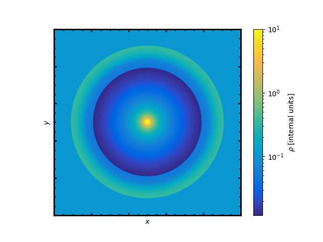

# SHOCKr-1d
SHOCKr is a 1D spherical hydro solver designed for studying the shock structure emerging from the interaction between a spherically symmetric wind and an ambient medium with any specified density, velocity and temperature structure.

<em> Fig. 1: Density slice of spherical outflow solution produced by SHOCKr. The central wind (modelled as a boundary condition) streams radially outwards until it encounters a reverse shock. The wind also drives a forward shock. Simulation performed in domain with 1,000 radial cells, using the HLLC Riemann solver. </em>

## Key Highlights

- **Spherical Modeling:** Simulate hydrodynamics in a 1D spherical framework.
- **Shock Structure Study:** Explore and analyze shock structures resulting from wind and ambient medium interaction.
- **On-the-Fly Shock Finder:** Shockr incorporates a real-time shock finder that dynamically identifies shock fronts during simulations without the need for post-processing.

## Euler Equations
Shockr is based on the spherical symmetric form of the Euler equations, governing fluid dynamics in a 1D radial direction. The set of equations solved by SHOCKr are

1. **Continuity Equation:**
   $$\ \frac{\partial \rho}{\partial t} + \frac{1}{r^2} \frac{\partial}{\partial r}(r^2 \rho v_r) = 0 \$$

2. **Radial Momentum Equation:**
   $$\ \frac{\partial (\rho v_r)}{\partial t} + \frac{1}{r^2} \frac{\partial}{\partial r}(r^2 \rho v_r^2 + P) = 0 \$$

3. **Energy Equation:**
   $$\ \frac{\partial E}{\partial t} + \frac{1}{r^2} \frac{\partial}{\partial r}\left(r^2 (E + P) v_r\right) = 0 \$$

Where:
- \(\rho\) is the density
- \(v_r\) is the radial velocity
- \(P\) is the pressure
- \(E\) is the total energy per unit volume

## Additional Features

- **Riemann Solvers:** SHOCKr includes two Riemann solvers: HLLC (Harten, Lax, van Leer, and Contact) and Rusanov,
- **Wind Boundary Condition:** The spherically symmetric wind is modeled as a boundary condition,
- **Cartesian 1D Support:** While primarily designed for spherical simulations, SHOCKr also supports Cartesian 1D simulations for added flexibility.

## Configuration File (config.txt)
SHOCKr uses a configuration file (`config.txt`) to define various simulation parameters. Below is a list of key parameters that can be customized in the configuration file:

1. **CFL (Courant-Friedrichs-Lewy) Parameter:**
   - *Description:* CFL parameter determines the size of the time step in the simulation.
   - *Example:* `CFL 0.3`

2. **Maximum Simulation Time:**
   - *Description:* The maximum simulation time determines the duration of the simulation in arbitrary units.
   - *Example:* `maxTime 0.5`

3. **Output Time Interval:**
   - *Description:* The time interval between consecutive outputs or snapshots of the simulation.
   - *Example:* `outputTimeInterval 0.01`

4. **Output Filename:**
   - *Description:* The name of the file where simulation results are stored.
   - *Example:* `outputFilename output.txt`

5. **Output Energy Filename:**
   - *Description:* The name of the file where energy-related output is stored.
   - *Example:* `outputEnergy energy.txt`

These parameters control the overall behavior and output of the SHOCKr simulation. Ensure the configuration file is formatted correctly, and values are adjusted based on the specific requirements of your simulation.

## In Development

- **External Gravitational Field:** 
- **Radiative Cooling:**
